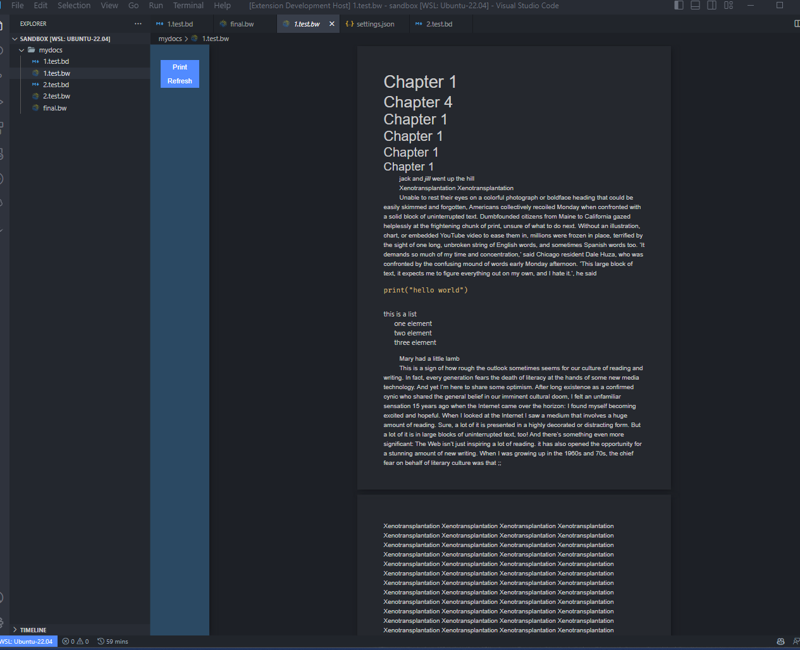

# extension-biteword README

This is software for writers (not software developers), that is currently in the form of a vscode extension

primary purpose of this is to create a legitimate rich text editor to rival word, but that can be written/saved in as actual text in a markdown/txt type file so that git comparisons can be made.

currently that comes in the form of a vscode extension. This is a perfect form for POC

for all intents and purposes, that language is currently markdown, but it's subject to mutate.

Possible Questions:

1. ### Why isn't word good enough?

   - as someone who used to write, and then learned to code, it's infuriating to go back to word. You lose easy text editing capabilities like `ctrl` + `atl` + `↓` to move a line down and any other ability to manipulate the actual underlying text, because you are essentially interacting with the presentation layer already instead of building the text to be presented
   - there is not source control with word. This is such an obvious boon to solo writers and especially collaborators. Word only provides its in-built tracking, which is a total nightmare to work with
   - most importantly Word is pretty much a closed-system monopoly. There is really nothing comporable to it, besides google docs, which i think suffers from many of the same pitfalls. It would be good for the world to give it a solid competitor that is open-source and extendable

2. ### Why isn't markdown good enough

   - main reason is pagination. You cannot format markdown to split text/elements between rigidly defined "pages". This gives you no control of how you want work to published/printed. By using a markdown-esque language as the editing layer, and then an html intermediary, you give the writer the ability to publish the text in many ways. Formating can change on the fly to suite where you want to publish to, be it a pdf, printer, Medium article, substack article, etc...
   - it lacks things critical to word/rich text editing. Two prime examples would be text justification and white space recognition
   - ### Sub Question: Aren't you just describing a new text parser?
     - kind of. A new parser is certainly part of it, but it's really a parser on top of a parser, which splits the html/text into the correct format. Currently this uses a standard md parser, but then manipulates the output
     - we would also want better text "decorations" in the text editor itself that recognize new extensions of the markdown-esque language, like justification tags

3. ### This sounds kind of boring?

   - it kind of is, which may be the reason no one has doen a good job on it yet. It's a lot of nitty-gritty rn and getting the nitty-gritty in place is certainly not super exciting work. It is educational though: one thing that has been shocking for me is to explore how much functionality I just take for granted from a browser/native computer (printing??!). Build a standalone reliable engine to do this presents all kinds of opportunities - see my TODO list which only hints at some of the ideas for where this could go

4. ### Where's it at now?
   - after many many iterations, i now have it reliably splitting text to respect predefined page-sizes and margins. Currently iterating on ways to print to a local printer - this is a problem that could be worthy of an extension itself.
   - It has also presented a more central problem which is making the output html to be a highly portable document (the css needs to come along for the ride and be interpretable by whatever rendering agent is controlling the print formatting, which kind of implies our rendering agent should control the print formatting)

Below is a really rough example, but it basically shows that it calculates element height reliably and split's text at the right place. (still need to handle splittling lists, code blocks, etcs)

